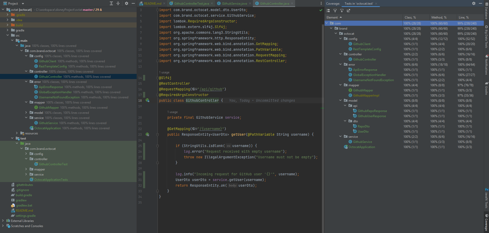

# **The Octocat Project – A GitHub User Info Aggregator**

---

## **Description**

The Octocat Project is a Spring Boot REST API that retrieves public GitHub user information and their repositories, 
transforms the data into a JSON format, and returns it to the client. 

The goal of this project is to demonstrate clean API design, 
layered architecture, and production-ready coding practices in Java 17.

---

## **Table of Contents**

1. [**Architecture and Design**](#architecture-and-design)
2. [**Technology**](#technology)
3. [**Using the API**](#using-the-api)
4. [**Testing and Coverage**](#testing-and-coverage)
5. [**Future Enhancements**](#future-enhancements)
6. [**Final Considerations**](#final-considerations)

---

## **Architecture and Design**

### High-Level Overview

Request flow:

**Client → Controller → Service → GitHub Client → GitHub API**  

### Layers

#### 1. Controller Layer

The class responsible for the controller layer is the `GithubController`. 
It exposes the endpoint `/api/github/{username}`, validates the username, delegates the work to `GithubService` and 
returns a `ResponseEntity<UserDto>` to the caller.

#### 2. Service Layer

The `GithubService` class Orchestrates the calls to `GithubClient` and `GithubMapper`, the classes responsible for 
calling Github endpoints and building the UserDto, respectively. It also caches the result of the Github endpoint calls,
so that repeated requests for the same username return the cached response instead of calling Github again.

#### 3. HTTP Client Layer

Class `GithubClient` wraps **RestTemplate** for outbound calls to the GitHub REST API. 

#### 4. Mapping Layer

Interface `GithubMapper` is a mapper that utilizes project Mapstruct to convert 
GitHub API models (`GithubUserResponse`, `GithubRepoResponse`) into internal DTOs (`UserDto`, `RepoDto`).
This keeps the service and controller free of mapping boilerplate and makes transformations easy to test.

#### 5. Error Handling Layer

Class `GlobalExceptionHandler` is annotated with @RestControllerAdvice, a strategy to avoid error boilerplates 
and centralize exception-to-HTTP-response mapping. This is a strategy to have more control over the errors 
to be returned along with its related HTTP response (Represented as a `ApiErrorResponse` class, caring error status, message and time).

Overall, this architecture aims to:

* Keep concerns separated (controller vs service vs client vs mapper);
* Make each part easy to test in isolation;
* Be straightforward to extend, for example by adding more GitHub endpoints or changing the persistence/caching strategy in the future.

---

## **Technology**

The technology chosen to make the service was: 
* Java 17 - The DTOs created are all records (Java 17) because they are immutable and very simple to create. Records were specially developed to cary data, are easily serialized and fits perfectly in data transferring environments.
* Spring Web - Used to expose the REST endpoint (`GET /api/github/{username}`) using Spring MVC.
* Spring Cache - Enables method-level caching with `@Cacheable("users")` in `GithubService`.
* Mapstruct - Eliminates manual mapping boilerplate.
* Lombok - Remove boilerplate of getters/setters/constructors and keep classes focused on behavior.
* JUnit 5 - Primary testing framework.
* Mockito - Used to mock dependencies.

---

## **Using the API**

Once the application is running, you can run http://localhost:8080/api/github/octocat in the browser or **Postman**, or curl -s http://localhost:8080/api/github/octocat
in the Terminal. This will return a 200 OK response:

```JSON
{
  "user_name": "octocat",
  "display_name": "The Octocat",
  "avatar": "https://avatars.githubusercontent.com/u/583231?v=4",
  "geo_location": "San Francisco",
  "email": null,
  "url": "https://api.github.com/users/octocat",
  "created_at": "Tue, 25 Jan 2011 18:44:36 GMT",
  "repos": [
    {
      "name": "boysenberry-repo-1",
      "url": "https://api.github.com/repos/octocat/boysenberry-repo-1"
    },
    {
      "name": "git-consortium",
      "url": "https://api.github.com/repos/octocat/git-consortium"
    },
    {
      "name": "hello-worId",
      "url": "https://api.github.com/repos/octocat/hello-worId"
    },
    {
      "name": "Hello-World",
      "url": "https://api.github.com/repos/octocat/Hello-World"
    },
    {
      "name": "linguist",
      "url": "https://api.github.com/repos/octocat/linguist"
    },
    {
      "name": "octocat.github.io",
      "url": "https://api.github.com/repos/octocat/octocat.github.io"
    },
    {
      "name": "Spoon-Knife",
      "url": "https://api.github.com/repos/octocat/Spoon-Knife"
    },
    {
      "name": "test-repo1",
      "url": "https://api.github.com/repos/octocat/test-repo1"
    }
  ]
}
```

In case a username does not exist, the `GlobalExceptionHandler` will capture the error and return a predefined `ApiErrorResponse` wrapped into a ResponseEntity object:

```JSON
{
  "error": "User Not Found",
  "status": "NOT_FOUND",
  "message": "GitHub user not found: thisIsNotARealUser1234",
  "timestamp": "2025-12-27T18:04:11.6198582-05:00"
}
```

Along with a warn log and exception message in the console:

```text
2025-12-27T18:04:11.603-05:00  WARN 24700 --- [githubService] [io-8080-exec-10] com.brand.octocat.config.GithubClient    : GitHub user not found. Path='/users/{username}', username='thisIsNotARealUser1234'.

org.springframework.web.client.HttpClientErrorException$NotFound: 404 Not Found on GET request for "https://api.github.com/users/thisIsNotARealUser1234": "{"message":"Not Found","documentation_url":"https://docs.github.com/rest","status":"404"}"
```

---

## **Testing and Coverage**

The project includes automated tests covering controller, service, client and mapper layers. All possible scenarios were covered, and the image shows.


*Test Coverage*

---

## **Future Enhancements**

As this is a testing challenge, some enhancements were not considered, as a token authentication to Github, Retry for 5xx errors, 
Swagger docs and a tool for Integration tests to be integrated with JUnit%, like Karate Framework or Cucumber. 

---

## **Final Considerations**

This project closely reflects my development methodology and professional experience. 
I prioritize designing small, cohesive, and easy-to-read classes, avoiding excessive comments that may introduce noise rather than clarity. 
I make use of libraries such as MapStruct and Lombok to abstract boilerplate code, resulting in cleaner and more concise implementations. 
In addition, I adopt centralized exception handling through @RestControllerAdvice and place strong emphasis on testing a wide range of scenarios and edge cases. 
Altogether, this project represents my engineering approach and the standards I strive to uphold in my daily work.


